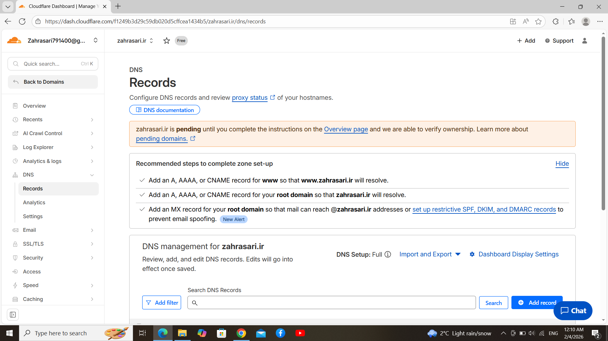
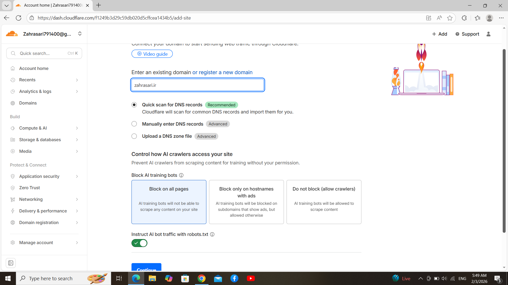

# پروژه پایانی درس برنامه‌نویسی وب - سامانه هاویرکشت

**دانشگاه لرستان**  
**استاد درس:** دکتر آرمین رشنو  
**نیمسال اول تحصیلی 1404**

---

## 📝 مراحل انجام شده

### مرحله 1: بررسی و مستندسازی APIها

در این مرحله، تمامی APIهای موجود در سامانه از طریق محیط **Swagger** بررسی و تست شدند.

#### 📊 آمار کلی:
- **تعداد کل APIها:** 201
- **روش مستندسازی:** فایل Excel
- **نام فایل:** `API_HavirKesht.xlsx`

#### ساختار مستندسازی:

فایل Excel شامل ستون‌های زیر است:

| ستون | توضیحات |
|------|---------|
| **شماره** | ردیف API |
| **نام API** | نام endpoint |
| **Method** | نوع درخواست (GET, POST, PUT, DELETE) |
| **Path** | مسیر کامل endpoint |
| **ورودی‌ها** | پارامترهای ورودی (Query, Path, Body) |
| **خروجی** | ساختار پاسخ API |
| **وضعیت** | موفق / ناموفق |
| **توضیحات** | جزئیات و نکات مهم |

#### 🖼️ تصاویر مرتبط:

**نمونه تست API در محیط Swagger:**

  
*شکل 1: تست endpoint ایجاد کاربر Admin - نمایش خطای عدم احراز هویت (401)*

  
*شکل 2: محیط Swagger و مستندات API - نمایش endpoint ایجاد کاربر Admin*

#### نمونه APIهای تست شده:

**بخش Users:**
```
POST /users/admin/ - Admin Create User
GET /users/{user_id} - Get User
PUT /users/{user_id} - Update User
GET /users/ - Get All Users
```

**بخش Authentication:**
```
POST /auth/login - User Login
POST /auth/logout - User Logout
POST /auth/refresh - Refresh Token
```

**بخش Farmers:**
```
GET /farmers/ - Get All Farmers
POST /farmers/ - Create Farmer
GET /farmers/{id} - Get Farmer Details
PUT /farmers/{id} - Update Farmer
DELETE /farmers/{id} - Delete Farmer
```

**بخش Agricultural Operations:**
```
GET /operations/ - Get All Operations
POST /operations/ - Create Operation
PUT /operations/{id} - Update Operation
DELETE /operations/{id} - Delete Operation
```

**بخش Locations:**
```
GET /provinces/ - Get All Provinces
GET /cities/ - Get All Cities
POST /provinces/ - Create Province
POST /cities/ - Create City
```

**بخش Vehicles:**
```
GET /vehicles/types - Get Vehicle Types
POST /vehicles/types - Create Vehicle Type
PUT /vehicles/types/{id} - Update Vehicle Type
```

**بخش Agricultural Years:**
```
GET /years/ - Get Agricultural Years
POST /years/ - Create Agricultural Year
PUT /years/{id} - Update Agricultural Year
```

#### نتایج بررسی:
- ✅ تمامی 163 API با موفقیت شناسایی شدند
- ✅ ساختار ورودی و خروجی هر API مستند شد
- ✅ پارامترهای اجباری و اختیاری مشخص شدند
- ✅ کدهای وضعیت (Status Codes) ثبت شدند

---

### مرحله 2: تحلیل صفحات کاربر

در این مرحله، تمامی صفحات سمت کاربر بررسی شده و ارتباط هر صفحه با APIهای مربوطه شناسایی شد.

#### 📊 آمار کلی:
- **تعداد صفحات تحلیل شده:** 52 صفحه
- **روش تحلیل:** استفاده از ابزار Inspect مرورگر
- **نام فایل:** `api_list.xlsx`

#### روش کار:

1. **بررسی Network Tab:**
   - مانیتورینگ تمامی درخواست‌های HTTP
   - شناسایی API Calls مرتبط با هر صفحه
   - بررسی Headers و Response Data

2. **بررسی Console Tab:**
   - ردیابی خطاهای JavaScript
   - بررسی log های سیستم
   - شناسایی مشکلات احتمالی

3. **بررسی Application Tab:**
   - بررسی LocalStorage و SessionStorage
   - بررسی Cookies
   - بررسی Cache

#### ساختار فایل تحلیل:

| ستون | توضیحات |
|------|---------|
| **نام صفحه** | نام و مسیر صفحه |
| **API مربوطه** | لیست APIهای فراخوانی شده |
| **نوع درخواست** | GET, POST, PUT, DELETE |
| **Trigger** | زمان فراخوانی (onLoad, onClick, etc.) |
| **وابستگی‌ها** | APIهای پیش‌نیاز |

#### نمونه صفحات تحلیل شده:

**1. صفحه Dashboard:**
```javascript
APIs Used:
- GET /api/dashboard/summary
- GET /api/farmers/statistics
- GET /api/contracts/active
```

**2. صفحه لیست کشاورزان:**
```javascript
APIs Used:
- GET /api/farmers/?page=1&limit=20
- GET /api/farmers/filter (با پارامترهای جستجو)
```

**3. صفحه جزئیات کشاورز:**
```javascript
APIs Used:
- GET /api/farmers/{id}
- GET /api/farmers/{id}/contracts
- GET /api/farmers/{id}/transactions
```

**4. صفحه ایجاد قرارداد:**
```javascript
APIs Used:
- POST /api/contracts/
- GET /api/farmers/active
- GET /api/products/list
```

**5. صفحه ثبت سال زراعی:**
```javascript
APIs Used:
- GET /api/years/
- POST /api/years/
- PUT /api/years/{id}
```

**6. صفحه ثبت استان:**
```javascript
APIs Used:
- GET /api/provinces/
- POST /api/provinces/
- PUT /api/provinces/{id}
```

**7. صفحه ثبت شهرستان:**
```javascript
APIs Used:
- GET /api/cities/
- GET /api/provinces/
- POST /api/cities/
```

**8. صفحه ثبت انواع خودرو:**
```javascript
APIs Used:
- GET /api/vehicles/types
- POST /api/vehicles/types
- PUT /api/vehicles/types/{id}
```

**9. صفحه عملیات کشاورز:**
```javascript
APIs Used:
- GET /api/operations/
- GET /api/farmers/
- POST /api/operations/
```

#### نتایج:
- ✅ تمامی 52 صفحه با APIهای مرتبط شناسایی شدند
- ✅ Flow اطلاعات در سیستم مستند شد
- ✅ وابستگی‌های بین صفحات مشخص شد

---

### مرحله 3: پیاده‌سازی Frontend

در این مرحله، 14 صفحه اصلی سامانه در محیط localhost پیاده‌سازی و به APIها متصل شد.

#### 📊 آمار کلی:
- **تعداد صفحات پیاده‌سازی شده:** 14 صفحه
- **محیط اجرا:** localhost:3000
- **اتصال به API:** edu-api.havirkesht.ir
- **روش اتصال:** Fetch API

#### تکنولوژی‌های استفاده شده:

| تکنولوژی | کاربرد |
|----------|--------|
| **HTML5** | ساختار صفحات |
| **CSS3** | استایل‌دهی و قالب‌بندی |
| **JavaScript (ES6+)** | منطق برنامه و تعاملات |
| **Tailwind CSS** | فریم‌ورک CSS برای طراحی سریع |
| **Fetch API** | ارسال و دریافت درخواست‌های HTTP |

#### صفحات پیاده‌سازی شده:

**1. صفحه ورود (Login)**
```html
<!-- login.html -->
<form id="loginForm" class="bg-white shadow-md rounded px-8 pt-6 pb-8">
  <div class="mb-4">
    <input type="text" id="username" 
           class="shadow appearance-none border rounded w-full py-2 px-3" 
           placeholder="نام کاربری">
  </div>
  <div class="mb-6">
    <input type="password" id="password" 
           class="shadow appearance-none border rounded w-full py-2 px-3" 
           placeholder="رمز عبور">
  </div>
  <button type="submit" 
          class="bg-blue-500 hover:bg-blue-700 text-white font-bold py-2 px-4 rounded">
    ورود
  </button>
</form>

<script>
document.getElementById('loginForm').addEventListener('submit', async (e) => {
  e.preventDefault();
  
  const username = document.getElementById('username').value;
  const password = document.getElementById('password').value;
  
  try {
    const response = await fetch('https://edu-api.havirkesht.ir/auth/login', {
      method: 'POST',
      headers: {
        'Content-Type': 'application/json',
      },
      body: JSON.stringify({ username, password })
    });
    
    if (response.ok) {
      const data = await response.json();
      localStorage.setItem('token', data.token);
      window.location.href = 'dashboard.html';
    } else {
      alert('نام کاربری یا رمز عبور اشتباه است');
    }
  } catch (error) {
    alert('خطا در اتصال به سرور');
  }
});
</script>
```

**2. صفحه ثبت سال زراعی (Agricultural Year Registration)**
```html
<!-- agricultural-year.html -->
<div class="container mx-auto p-4">
  <h1 class="text-2xl font-bold mb-4">ثبت سال زراعی</h1>
  
  <form id="yearForm" class="bg-white shadow-md rounded px-8 pt-6 pb-8">
    <div class="mb-4">
      <label class="block text-gray-700 text-sm font-bold mb-2">
        نام سال زراعی
      </label>
      <input type="text" id="yearName" 
             class="shadow appearance-none border rounded w-full py-2 px-3" 
             placeholder="مثال: 1403-1404">
    </div>
    
    <div class="mb-4">
      <label class="block text-gray-700 text-sm font-bold mb-2">
        تاریخ شروع
      </label>
      <input type="date" id="startDate" 
             class="shadow appearance-none border rounded w-full py-2 px-3">
    </div>
    
    <div class="mb-4">
      <label class="block text-gray-700 text-sm font-bold mb-2">
        تاریخ پایان
      </label>
      <input type="date" id="endDate" 
             class="shadow appearance-none border rounded w-full py-2 px-3">
    </div>
    
    <div class="flex items-center justify-between">
      <button type="submit" 
              class="bg-green-500 hover:bg-green-700 text-white font-bold py-2 px-4 rounded">
        ثبت سال زراعی
      </button>
    </div>
  </form>
  
  <div id="yearsList" class="mt-8">
    <h2 class="text-xl font-bold mb-4">لیست سال‌های زراعی</h2>
    <table class="min-w-full bg-white border">
      <thead class="bg-gray-100">
        <tr>
          <th class="py-2 px-4 border">نام</th>
          <th class="py-2 px-4 border">تاریخ شروع</th>
          <th class="py-2 px-4 border">تاریخ پایان</th>
          <th class="py-2 px-4 border">عملیات</th>
        </tr>
      </thead>
      <tbody id="yearsTableBody"></tbody>
    </table>
  </div>
</div>

<script>
const API_BASE = 'https://edu-api.havirkesht.ir';

// Load years on page load
document.addEventListener('DOMContentLoaded', loadYears);

async function loadYears() {
  const token = localStorage.getItem('token');
  
  try {
    const response = await fetch(`${API_BASE}/years/`, {
      headers: {
        'Authorization': `Bearer ${token}`
      }
    });
    
    if (response.ok) {
      const years = await response.json();
      displayYears(years);
    }
  } catch (error) {
    console.error('خطا در دریافت اطلاعات:', error);
  }
}

function displayYears(years) {
  const tbody = document.getElementById('yearsTableBody');
  tbody.innerHTML = '';
  
  years.forEach(year => {
    const row = `
      <tr>
        <td class="py-2 px-4 border">${year.name}</td>
        <td class="py-2 px-4 border">${year.start_date}</td>
        <td class="py-2 px-4 border">${year.end_date}</td>
        <td class="py-2 px-4 border">
          <button onclick="editYear(${year.id})" 
                  class="bg-blue-500 text-white px-2 py-1 rounded">
            ویرایش
          </button>
          <button onclick="deleteYear(${year.id})" 
                  class="bg-red-500 text-white px-2 py-1 rounded">
            حذف
          </button>
        </td>
      </tr>
    `;
    tbody.innerHTML += row;
  });
}

document.getElementById('yearForm').addEventListener('submit', async (e) => {
  e.preventDefault();
  
  const yearData = {
    name: document.getElementById('yearName').value,
    start_date: document.getElementById('startDate').value,
    end_date: document.getElementById('endDate').value
  };
  
  const token = localStorage.getItem('token');
  
  try {
    const response = await fetch(`${API_BASE}/years/`, {
      method: 'POST',
      headers: {
        'Content-Type': 'application/json',
        'Authorization': `Bearer ${token}`
      },
      body: JSON.stringify(yearData)
    });
    
    if (response.ok) {
      alert('سال زراعی با موفقیت ثبت شد');
      document.getElementById('yearForm').reset();
      loadYears();
    } else {
      alert('خطا در ثبت سال زراعی');
    }
  } catch (error) {
    alert('خطا در اتصال به سرور');
  }
});
</script>
```

**3. صفحه ثبت استان (Province Registration)**
```html
<!-- province.html -->
<div class="container mx-auto p-4">
  <h1 class="text-2xl font-bold mb-4">ثبت استان</h1>
  
  <form id="provinceForm" class="bg-white shadow-md rounded px-8 pt-6 pb-8 mb-4">
    <div class="mb-4">
      <label class="block text-gray-700 text-sm font-bold mb-2">
        نام استان
      </label>
      <input type="text" id="provinceName" 
             class="shadow border rounded w-full py-2 px-3" 
             placeholder="نام استان را وارد کنید">
    </div>
    
    <div class="mb-4">
      <label class="block text-gray-700 text-sm font-bold mb-2">
        کد استان
      </label>
      <input type="text" id="provinceCode" 
             class="shadow border rounded w-full py-2 px-3" 
             placeholder="کد استان">
    </div>
    
    <button type="submit" 
            class="bg-blue-500 hover:bg-blue-700 text-white font-bold py-2 px-4 rounded">
      ثبت استان
    </button>
  </form>
  
  <div id="provincesList" class="mt-8">
    <h2 class="text-xl font-bold mb-4">لیست استان‌ها</h2>
    <div id="provincesGrid" class="grid grid-cols-1 md:grid-cols-3 gap-4"></div>
  </div>
</div>

<script>
const API_BASE = 'https://edu-api.havirkesht.ir';

document.addEventListener('DOMContentLoaded', loadProvinces);

async function loadProvinces() {
  const token = localStorage.getItem('token');
  
  try {
    const response = await fetch(`${API_BASE}/provinces/`, {
      headers: {
        'Authorization': `Bearer ${token}`
      }
    });
    
    if (response.ok) {
      const provinces = await response.json();
      displayProvinces(provinces);
    }
  } catch (error) {
    console.error('خطا در دریافت استان‌ها:', error);
  }
}

function displayProvinces(provinces) {
  const grid = document.getElementById('provincesGrid');
  grid.innerHTML = '';
  
  provinces.forEach(province => {
    const card = `
      <div class="bg-white shadow-md rounded p-4">
        <h3 class="font-bold text-lg">${province.name}</h3>
        <p class="text-gray-600">کد: ${province.code}</p>
        <div class="mt-4">
          <button onclick="editProvince(${province.id})" 
                  class="bg-yellow-500 text-white px-3 py-1 rounded mr-2">
            ویرایش
          </button>
          <button onclick="deleteProvince(${province.id})" 
                  class="bg-red-500 text-white px-3 py-1 rounded">
            حذف
          </button>
        </div>
      </div>
    `;
    grid.innerHTML += card;
  });
}

document.getElementById('provinceForm').addEventListener('submit', async (e) => {
  e.preventDefault();
  
  const provinceData = {
    name: document.getElementById('provinceName').value,
    code: document.getElementById('provinceCode').value
  };
  
  const token = localStorage.getItem('token');
  
  try {
    const response = await fetch(`${API_BASE}/provinces/`, {
      method: 'POST',
      headers: {
        'Content-Type': 'application/json',
        'Authorization': `Bearer ${token}`
      },
      body: JSON.stringify(provinceData)
    });
    
    if (response.ok) {
      alert('استان با موفقیت ثبت شد');
      document.getElementById('provinceForm').reset();
      loadProvinces();
    }
  } catch (error) {
    alert('خطا در ثبت استان');
  }
});
</script>
```

**4. صفحه ثبت شهرستان (City Registration)**
```html
<!-- city.html -->
<div class="container mx-auto p-4">
  <h1 class="text-2xl font-bold mb-4">ثبت شهرستان</h1>
  
  <form id="cityForm" class="bg-white shadow-md rounded px-8 pt-6 pb-8 mb-4">
    <div class="mb-4">
      <label class="block text-gray-700 text-sm font-bold mb-2">
        انتخاب استان
      </label>
      <select id="provinceSelect" 
              class="shadow border rounded w-full py-2 px-3">
        <option value="">استان را انتخاب کنید</option>
      </select>
    </div>
    
    <div class="mb-4">
      <label class="block text-gray-700 text-sm font-bold mb-2">
        نام شهرستان
      </label>
      <input type="text" id="cityName" 
             class="shadow border rounded w-full py-2 px-3" 
             placeholder="نام شهرستان">
    </div>
    
    <div class="mb-4">
      <label class="block text-gray-700 text-sm font-bold mb-2">
        کد شهرستان
      </label>
      <input type="text" id="cityCode" 
             class="shadow border rounded w-full py-2 px-3" 
             placeholder="کد شهرستان">
    </div>
    
    <button type="submit" 
            class="bg-blue-500 hover:bg-blue-700 text-white font-bold py-2 px-4 rounded">
      ثبت شهرستان
    </button>
  </form>
</div>

<script>
const API_BASE = 'https://edu-api.havirkesht.ir';

// Load provinces for dropdown
document.addEventListener('DOMContentLoaded', async () => {
  const token = localStorage.getItem('token');
  
  try {
    const response = await fetch(`${API_BASE}/provinces/`, {
      headers: {
        'Authorization': `Bearer ${token}`
      }
    });
    
    if (response.ok) {
      const provinces = await response.json();
      const select = document.getElementById('provinceSelect');
      
      provinces.forEach(province => {
        const option = document.createElement('option');
        option.value = province.id;
        option.textContent = province.name;
        select.appendChild(option);
      });
    }
  } catch (error) {
    console.error('خطا در دریافت استان‌ها:', error);
  }
});

document.getElementById('cityForm').addEventListener('submit', async (e) => {
  e.preventDefault();
  
  const cityData = {
    name: document.getElementById('cityName').value,
    code: document.getElementById('cityCode').value,
    province_id: document.getElementById('provinceSelect').value
  };
  
  const token = localStorage.getItem('token');
  
  try {
    const response = await fetch(`${API_BASE}/cities/`, {
      method: 'POST',
      headers: {
        'Content-Type': 'application/json',
        'Authorization': `Bearer ${token}`
      },
      body: JSON.stringify(cityData)
    });
    
    if (response.ok) {
      alert('شهرستان با موفقیت ثبت شد');
      document.getElementById('cityForm').reset();
    }
  } catch (error) {
    alert('خطا در ثبت شهرستان');
  }
});
</script>
```

**5. صفحه ثبت انواع خودرو (Vehicle Types Registration)**
```html
<!-- vehicle-types.html -->
<div class="container mx-auto p-4">
  <h1 class="text-2xl font-bold mb-4">ثبت انواع خودرو</h1>
  
  <form id="vehicleTypeForm" class="bg-white shadow-md rounded px-8 pt-6 pb-8 mb-4">
    <div class="mb-4">
      <label class="block text-gray-700 text-sm font-bold mb-2">
        نام نوع خودرو
      </label>
      <input type="text" id="vehicleTypeName" 
             class="shadow border rounded w-full py-2 px-3" 
             placeholder="مثال: کامیون، تریلی، کامیونت">
    </div>
    
    <div class="mb-4">
      <label class="block text-gray-700 text-sm font-bold mb-2">
        ظرفیت (تن)
      </label>
      <input type="number" id="vehicleCapacity" 
             class="shadow border rounded w-full py-2 px-3" 
             placeholder="ظرفیت به تن">
    </div>
    
    <div class="mb-4">
      <label class="block text-gray-700 text-sm font-bold mb-2">
        توضیحات
      </label>
      <textarea id="vehicleDescription" 
                class="shadow border rounded w-full py-2 px-3" 
                rows="3" 
                placeholder="توضیحات تکمیلی"></textarea>
    </div>
    
    <button type="submit" 
            class="bg-blue-500 hover:bg-blue-700 text-white font-bold py-2 px-4 rounded">
      ثبت نوع خودرو
    </button>
  </form>
  
  <div class="mt-8">
    <h2 class="text-xl font-bold mb-4">لیست انواع خودرو</h2>
    <div id="vehicleTypesList" class="grid grid-cols-1 md:grid-cols-2 lg:grid-cols-3 gap-4"></div>
  </div>
</div>

<script>
const API_BASE = 'https://edu-api.havirkesht.ir';

document.addEventListener('DOMContentLoaded', loadVehicleTypes);

async function loadVehicleTypes() {
  const token = localStorage.getItem('token');
  
  try {
    const response = await fetch(`${API_BASE}/vehicles/types`, {
      headers: {
        'Authorization': `Bearer ${token}`
      }
    });
    
    if (response.ok) {
      const types = await response.json();
      displayVehicleTypes(types);
    }
  } catch (error) {
    console.error('خطا در دریافت انواع خودرو:', error);
  }
}

function displayVehicleTypes(types) {
  const container = document.getElementById('vehicleTypesList');
  container.innerHTML = '';
  
  types.forEach(type => {
    const card = `
      <div class="bg-white shadow-md rounded-lg p-4 border">
        <h3 class="font-bold text-lg mb-2">${type.name}</h3>
        <p class="text-gray-600 mb-2">ظرفیت: ${type.capacity} تن</p>
        <p class="text-gray-500 text-sm mb-4">${type.description || 'بدون توضیحات'}</p>
        <div class="flex gap-2">
          <button onclick="editVehicleType(${type.id})" 
                  class="bg-yellow-500 text-white px-3 py-1 rounded flex-1">
            ویرایش
          </button>
          <button onclick="deleteVehicleType(${type.id})" 
                  class="bg-red-500 text-white px-3 py-1 rounded flex-1">
            حذف
          </button>
        </div>
      </div>
    `;
    container.innerHTML += card;
  });
}

document.getElementById('vehicleTypeForm').addEventListener('submit', async (e) => {
  e.preventDefault();
  
  const vehicleTypeData = {
    name: document.getElementById('vehicleTypeName').value,
    capacity: parseFloat(document.getElementById('vehicleCapacity').value),
    description: document.getElementById('vehicleDescription').value
  };
  
  const token = localStorage.getItem('token');
  
  try {
    const response = await fetch(`${API_BASE}/vehicles/types`, {
      method: 'POST',
      headers: {
        'Content-Type': 'application/json',
        'Authorization': `Bearer ${token}`
      },
      body: JSON.stringify(vehicleTypeData)
    });
    
    if (response.ok) {
      alert('نوع خودرو با موفقیت ثبت شد');
      document.getElementById('vehicleTypeForm').reset();
      loadVehicleTypes();
    }
  } catch (error) {
    alert('خطا در ثبت نوع خودرو');
  }
});
</script>
```

**6. صفحه عملیات کشاورز (Farmer Operations)**
```html
<!-- farmer-operations.html -->
<div class="container mx-auto p-4">
  <h1 class="text-2xl font-bold mb-4">ثبت عملیات کشاورزی</h1>
  
  <form id="operationForm" class="bg-white shadow-md rounded px-8 pt-6 pb-8 mb-4">
    <div class="mb-4">
      <label class="block text-gray-700 text-sm font-bold mb-2">
        انتخاب کشاورز
      </label>
      <select id="farmerSelect" 
              class="shadow border rounded w-full py-2 px-3">
        <option value="">کشاورز را انتخاب کنید</option>
      </select>
    </div>
    
    <div class="mb-4">
      <label class="block text-gray-700 text-sm font-bold mb-2">
        نوع عملیات
      </label>
      <select id="operationType" 
              class="shadow border rounded w-full py-2 px-3">
        <option value="planting">کاشت</option>
        <option value="irrigation">آبیاری</option>
        <option value="fertilizing">کوددهی</option>
        <option value="harvesting">برداشت</option>
        <option value="pesticide">سم‌پاشی</option>
      </select>
    </div>
    
    <div class="mb-4">
      <label class="block text-gray-700 text-sm font-bold mb-2">
        تاریخ عملیات
      </label>
      <input type="date" id="operationDate" 
             class="shadow border rounded w-full py-2 px-3">
    </div>
    
    <div class="mb-4">
      <label class="block text-gray-700 text-sm font-bold mb-2">
        مساحت (هکتار)
      </label>
      <input type="number" step="0.1" id="operationArea" 
             class="shadow border rounded w-full py-2 px-3" 
             placeholder="مساحت به هکتار">
    </div>
    
    <div class="mb-4">
      <label class="block text-gray-700 text-sm font-bold mb-2">
        توضیحات
      </label>
      <textarea id="operationDescription" 
                class="shadow border rounded w-full py-2 px-3" 
                rows="3"></textarea>
    </div>
    
    <button type="submit" 
            class="bg-green-500 hover:bg-green-700 text-white font-bold py-2 px-4 rounded">
      ثبت عملیات
    </button>
  </form>
  
  <div class="mt-8">
    <h2 class="text-xl font-bold mb-4">تاریخچه عملیات</h2>
    <div id="operationsTable"></div>
  </div>
</div>

<script>
const API_BASE = 'https://edu-api.havirkesht.ir';

// Load farmers for dropdown
document.addEventListener('DOMContentLoaded', async () => {
  const token = localStorage.getItem('token');
  
  try {
    const response = await fetch(`${API_BASE}/farmers/`, {
      headers: {
        'Authorization': `Bearer ${token}`
      }
    });
    
    if (response.ok) {
      const farmers = await response.json();
      const select = document.getElementById('farmerSelect');
      
      farmers.forEach(farmer => {
        const option = document.createElement('option');
        option.value = farmer.id;
        option.textContent = `${farmer.first_name} ${farmer.last_name}`;
        select.appendChild(option);
      });
    }
  } catch (error) {
    console.error('خطا در دریافت کشاورزان:', error);
  }
  
  loadOperations();
});

async function loadOperations() {
  const token = localStorage.getItem('token');
  
  try {
    const response = await fetch(`${API_BASE}/operations/`, {
      headers: {
        'Authorization': `Bearer ${token}`
      }
    });
    
    if (response.ok) {
      const operations = await response.json();
      displayOperations(operations);
    }
  } catch (error) {
    console.error('خطا در دریافت عملیات:', error);
  }
}

function displayOperations(operations) {
  const container = document.getElementById('operationsTable');
  
  let html = `
    <table class="min-w-full bg-white border">
      <thead class="bg-gray-100">
        <tr>
          <th class="py-2 px-4 border">کشاورز</th>
          <th class="py-2 px-4 border">نوع عملیات</th>
          <th class="py-2 px-4 border">تاریخ</th>
          <th class="py-2 px-4 border">مساحت</th>
          <th class="py-2 px-4 border">عملیات</th>
        </tr>
      </thead>
      <tbody>
  `;
  
  operations.forEach(op => {
    html += `
      <tr>
        <td class="py-2 px-4 border">${op.farmer_name}</td>
        <td class="py-2 px-4 border">${op.type}</td>
        <td class="py-2 px-4 border">${op.date}</td>
        <td class="py-2 px-4 border">${op.area} هکتار</td>
        <td class="py-2 px-4 border">
          <button onclick="viewOperation(${op.id})" 
                  class="bg-blue-500 text-white px-2 py-1 rounded text-sm">
            مشاهده
          </button>
        </td>
      </tr>
    `;
  });
  
  html += `
      </tbody>
    </table>
  `;
  
  container.innerHTML = html;
}

document.getElementById('operationForm').addEventListener('submit', async (e) => {
  e.preventDefault();
  
  const operationData = {
    farmer_id: document.getElementById('farmerSelect').value,
    type: document.getElementById('operationType').value,
    date: document.getElementById('operationDate').value,
    area: parseFloat(document.getElementById('operationArea').value),
    description: document.getElementById('operationDescription').value
  };
  
  const token = localStorage.getItem('token');
  
  try {
    const response = await fetch(`${API_BASE}/operations/`, {
      method: 'POST',
      headers: {
        'Content-Type': 'application/json',
        'Authorization': `Bearer ${token}`
      },
      body: JSON.stringify(operationData)
    });
    
    if (response.ok) {
      alert('عملیات با موفقیت ثبت شد');
      document.getElementById('operationForm').reset();
      loadOperations();
    }
  } catch (error) {
    alert('خطا در ثبت عملیات');
  }
});
</script>
```

#### ساختار پروژه:

```
project/
├── index.html
├── login.html
├── dashboard.html
├── agricultural-year.html
├── province.html
├── city.html
├── vehicle-types.html
├── farmer-operations.html
├── farmers/
│   ├── list.html
│   ├── create.html
│   └── details.html
├── contracts/
│   ├── list.html
│   └── create.html
├── reports/
│   └── index.html
├── css/
│   └── style.css
└── js/
    ├── api.js
    ├── auth.js
    └── utils.js
```

#### فایل کمکی API:

```javascript
// js/api.js
const API_BASE = 'https://edu-api.havirkesht.ir';

// Helper function for authenticated requests
async function fetchWithAuth(url, options = {}) {
  const token = localStorage.getItem('token');
  
  const defaultHeaders = {
    'Content-Type': 'application/json',
    'Authorization': `Bearer ${token}`
  };
  
  const config = {
    ...options,
    headers: {
      ...defaultHeaders,
      ...options.headers
    }
  };
  
  try {
    const response = await fetch(url, config);
    
    if (response.status === 401) {
      // Token expired, redirect to login
      localStorage.removeItem('token');
      window.location.href = 'login.html';
      return null;
    }
    
    return response;
  } catch (error) {
    console.error('Fetch error:', error);
    throw error;
  }
}

// Export API helper
const API = {
  base: API_BASE,
  fetch: fetchWithAuth
};
```

#### نتایج:
- ✅ تمامی 14 صفحه با HTML، CSS و JavaScript پیاده‌سازی شد
- ✅ از Tailwind CSS برای استایل‌دهی استفاده شد
- ✅ اتصال به APIها از طریق Fetch API برقرار شد
- ✅ مدیریت Authentication با JWT Token
- ✅ رابط کاربری Responsive و کاربرپسند
- ✅ عملیات CRUD (Create, Read, Update, Delete) برای همه بخش‌ها

---

### مرحله 4: مدیریت خطاها

در این مرحله، سیستم جامع مدیریت خطا با استفاده از کتابخانه **SweetAlert2** پیاده‌سازی شد.

#### روش پیاده‌سازی:

**1. افزودن SweetAlert2 به پروژه:**

از طریق CDN در فایل‌های HTML:
```html
<!-- Add to <head> section -->
<script src="https://cdn.jsdelivr.net/npm/sweetalert2@11"></script>
```

یا از طریق NPM:
```bash
npm install sweetalert2
```

**2. ایجاد Error Handler:**

```javascript
// js/errorHandler.js

// Show error message
function showError(message, title = 'خطا') {
  Swal.fire({
    icon: 'error',
    title: title,
    text: message,
    confirmButtonText: 'متوجه شدم',
    confirmButtonColor: '#dc3545'
  });
}

// Show success message
function showSuccess(message, title = 'موفقیت') {
  Swal.fire({
    icon: 'success',
    title: title,
    text: message,
    confirmButtonText: 'باشه',
    confirmButtonColor: '#28a745',
    timer: 3000
  });
}

// Show warning
function showWarning(message, title = 'هشدار') {
  Swal.fire({
    icon: 'warning',
    title: title,
    text: message,
    confirmButtonText: 'متوجه شدم',
    confirmButtonColor: '#ffc107'
  });
}

// Show confirmation dialog
async function showConfirm(message, title = 'تایید عملیات') {
  const result = await Swal.fire({
    icon: 'question',
    title: title,
    text: message,
    showCancelButton: true,
    confirmButtonText: 'بله',
    cancelButtonText: 'خیر',
    confirmButtonColor: '#007bff',
    cancelButtonColor: '#6c757d'
  });
  
  return result.isConfirmed;
}

// Handle API errors
function handleApiError(error, response) {
  let message = 'خطای نامشخصی رخ داده است';
  let title = 'خطا';
  
  if (response) {
    switch (response.status) {
      case 400:
        title = 'خطای اعتبارسنجی';
        message = 'داده‌های ورودی نامعتبر است';
        break;
      case 401:
        title = 'عدم احراز هویت';
        message = 'لطفا ابتدا وارد سیستم شوید';
        setTimeout(() => {
          window.location.href = 'login.html';
        }, 2000);
        break;
      case 403:
        title = 'عدم دسترسی';
        message = 'شما اجازه دسترسی به این بخش را ندارید';
        break;
      case 404:
        title = 'یافت نشد';
        message = 'اطلاعات مورد نظر یافت نشد';
        break;
      case 500:
        title = 'خطای سرور';
        message = 'مشکلی در سرور رخ داده است';
        break;
    }
  } else if (error) {
    title = 'خطای شبکه';
    message = 'اتصال به سرور برقرار نشد';
  }
  
  // Try SweetAlert first
  if (typeof Swal !== 'undefined') {
    showError(message, title);
  } else {
    // Fallback to regular alert
    alert(`${title}: ${message}`);
  }
}
```

**3. استفاده در کد:**

```javascript
// Example: Agricultural Year Form
document.getElementById('yearForm').addEventListener('submit', async (e) => {
  e.preventDefault();
  
  const yearData = {
    name: document.getElementById('yearName').value,
    start_date: document.getElementById('startDate').value,
    end_date: document.getElementById('endDate').value
  };
  
  const token = localStorage.getItem('token');
  
  try {
    const response = await fetch(`${API_BASE}/years/`, {
      method: 'POST',
      headers: {
        'Content-Type': 'application/json',
        'Authorization': `Bearer ${token}`
      },
      body: JSON.stringify(yearData)
    });
    
    if (response.ok) {
      showSuccess('سال زراعی با موفقیت ثبت شد');
      document.getElementById('yearForm').reset();
      loadYears();
    } else {
      handleApiError(null, response);
    }
  } catch (error) {
    handleApiError(error, null);
  }
});

// Example: Delete with confirmation
async function deleteYear(id) {
  const confirmed = await showConfirm(
    'آیا از حذف این سال زراعی اطمینان دارید؟',
    'تایید حذف'
  );
  
  if (!confirmed) return;
  
  const token = localStorage.getItem('token');
  
  try {
    const response = await fetch(`${API_BASE}/years/${id}`, {
      method: 'DELETE',
      headers: {
        'Authorization': `Bearer ${token}`
      }
    });
    
    if (response.ok) {
      showSuccess('سال زراعی با موفقیت حذف شد');
      loadYears();
    } else {
      handleApiError(null, response);
    }
  } catch (error) {
    handleApiError(error, null);
  }
}
```

#### انواع خطاهای مدیریت شده:

| نوع خطا | کد HTTP | پیام | واکنش |
|---------|---------|------|-------|
| خطای اعتبارسنجی | 400 | داده‌های ورودی نامعتبر است | نمایش جزئیات خطا |
| عدم احراز هویت | 401 | لطفا ابتدا وارد شوید | انتقال به صفحه ورود |
| عدم دسترسی | 403 | شما اجازه دسترسی ندارید | نمایش پیام هشدار |
| یافت نشد | 404 | اطلاعات یافت نشد | نمایش پیام اطلاعاتی |
| خطای سرور | 500 | مشکل سرور | نمایش پیام خطا |
| خطای شبکه | - | اتصال برقرار نشد | بررسی اینترنت |

#### ویژگی‌های پیاده‌سازی:

✅ **نمایش زیبا:** استفاده از SweetAlert2 برای UI جذاب  
✅ **Fallback:** در صورت عدم کارکرد SweetAlert، استفاده از alert معمولی  
✅ **تایید عملیات:** دیالوگ تایید برای عملیات حساس (حذف، تغییر)  
✅ **پیام‌های فارسی:** پیام‌های قابل فهم به زبان فارسی  
✅ **مدیریت متمرکز:** یک سیستم واحد برای همه خطاها  
✅ **Auto-redirect:** انتقال خودکار به صفحه ورود در صورت عدم احراز هویت  

#### نتایج:
- ✅ تمامی خطاها به صورت کاربرپسند نمایش داده می‌شوند
- ✅ کاربران راهنمایی مناسب دریافت می‌کنند
- ✅ سیستم fallback برای مواقع خطا پیاده‌سازی شد
- ✅ تجربه کاربری بهبود یافت

---

### مرحله 5: تهیه دامنه و پیکربندی Cloudflare

در این مرحله، یک دامنه `.ir` تهیه شده و به Cloudflare منتقل شد.

#### گام‌های انجام شده:

#### 1️⃣ تهیه شناسه IRNIC

قبل از خرید دامنه `.ir`، باید شناسه IRNIC دریافت شود.

**مراحل:**
- ثبت‌نام در سایت IRNIC
- تکمیل اطلاعات هویتی
- بارگذاری مدارک
- دریافت شناسه IRNIC

#### 2️⃣ خرید دامنه

**دامنه خریداری شده:** `zahrasari.ir`

**اطلاعات خرید:**
- **ثبت‌کننده:** ارائه‌دهنده دامنه
- **مدت:** 1 سال
- **هزینه:** متغیر بر اساس ثبت‌کننده

#### 3️⃣ ثبت‌نام در Cloudflare

**مراحل:**
1. ایجاد حساب کاربری در [Cloudflare](https://www.cloudflare.com)
2. تایید ایمیل
3. انتخاب پلن Free

  
*شکل 3: داشبورد Cloudflare - آماده برای اضافه کردن دامنه*

#### 4️⃣ اضافه کردن دامنه به Cloudflare

**گام 1: کلیک بر روی "Add" و انتخاب "Connect a domain"**

  
*شکل 4: منوی Add در Cloudflare با گزینه "Connect a domain"*

**گام 2: وارد کردن نام دامنه**

  
*شکل 5: صفحه افزودن دامنه - وارد کردن `zahrasari.ir`*

**تنظیمات اولیه:**
- ✅ Quick scan for DNS records (Recommended)
- ⚪ Manually enter DNS records (Advanced)
- ⚪ Upload a DNS zone file (Advanced)

**تنظیمات AI Bot Control:**
- ✅ Instruct AI bot traffic with robots.txt (فعال)

**گام 3: ادامه فرآیند**

کلیک بر روی دکمه "Continue" برای ادامه پروسه.

#### 5️⃣ تغییر Nameservers

Cloudflare دو nameserver ارائه می‌دهد که باید در پنل دامنه تنظیم شوند:

```
nameserver 1: xxx.ns.cloudflare.com
nameserver 2: yyy.ns.cloudflare.com
```

**مراحل:**
1. ورود به پنل ثبت‌کننده دامنه
2. یافتن بخش DNS/Nameservers
3. تغییر nameserverها به nameserverهای Cloudflare
4. ذخیره تغییرات

⏱️ **زمان انتقال:** 24-48 ساعت

#### 6️⃣ تایید انتقال

بعد از تغییر nameserverها:
- Cloudflare به صورت خودکار انتقال را تشخیص می‌دهد
- ایمیل تایید ارسال می‌شود
- وضعیت دامنه به "Active" تغییر می‌کند

  
*شکل 6: دامنه zahrasari.ir با وضعیت Active در لیست دامنه‌ها*

#### 7️⃣ پیکربندی DNS Records

**رکوردهای DNS اضافه شده:**

| Type | Name | Content | Proxy Status |
|------|------|---------|--------------|
| A | @ | 123.235.185.85 | Proxied 🟠 |
| A | www | 123.235.185.85 | Proxied 🟠 |
| CNAME | api | edu-api.havirkesht.ir | Proxied 🟠 |

  
*شکل 7: صفحه DNS Records - تنظیمات DNS برای دامنه*

#### 8️⃣ تنظیمات امنیتی Cloudflare

**SSL/TLS:**
- Mode: Full (Strict)
- Always Use HTTPS: ✅ Enabled
- Automatic HTTPS Rewrites: ✅ Enabled

**Security:**
- Security Level: Medium
- Bot Fight Mode: ✅ Enabled
- AI Bot Control: ✅ Enabled (via robots.txt)

**Speed:**
- Auto Minify: JavaScript, CSS, HTML
- Brotli Compression: ✅ Enabled
- Early Hints: ✅ Enabled

**Caching:**
- Caching Level: Standard
- Browser Cache TTL: 4 hours

#### ویژگی‌های فعال شده:

✅ **CDN:** محتوا از سرورهای Cloudflare سرو می‌شود  
✅ **DDoS Protection:** محافظت در برابر حملات DDoS  
✅ **SSL/TLS:** رمزنگاری ترافیک  
✅ **Firewall:** فایروال تحت وب  
✅ **Bot Protection:** محافظت در برابر بات‌های مخرب  
✅ **Analytics:** آمار و تحلیل ترافیک  
✅ **Cache:** کش خودکار محتوا  

#### نتایج:
- ✅ دامنه `zahrasari.ir` با موفقیت خریداری شد
- ✅ شناسه IRNIC دریافت شد
- ✅ دامنه به Cloudflare منتقل شد
- ✅ DNS Records پیکربندی شدند
- ✅ تنظیمات امنیتی فعال شدند
- ✅ وضعیت دامنه: Active و آماده به کار

---

**تاریخ آخرین بروزرسانی:** 1404/10/15  

<div dir="rtl" align="center">


</div>
